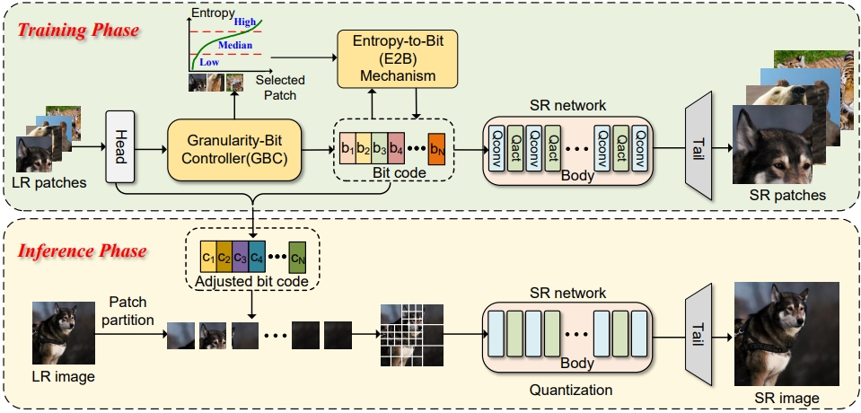

# Thinking in Granularity: Dynamic Quantization for Image Super-Resolution by Intriguing Multi-Granularity Clues
### This project is the official implementation of paper *Thinking in Granularity: Dynamic Quantization for Image Super-Resolution by Intriguing Multi-Granularity Clues*.


### Supplementart Material for Granular-DQ https://github.com/MmmingS/Granular-DQ/blob/master/Supplementary_Material_Granular_DQ.pdf

#### 🔥🔥🔥 News 
- **2024-12-16:** Code release!
- **2024-12-10:** Our paper has been accepted by AAAI2025!!

## Requirements

```
cd Granular-DQ
conda env create -f environment.yaml
conda activate GDQ
```

## Preparation
### Datasets

* For training, we use LR images sampled from [DIV2K](https://cv.snu.ac.kr/research/EDSR/DIV2K.tar).
* For testing, we use [benchmark datasets](https://cv.snu.ac.kr/research/EDSR/benchmark.tar) and large input datasets [Test2K,4K,8K](https://drive.google.com/drive/folders/18b3QKaDJdrd9y0KwtrWU2Vp9nHxvfTZH?usp=sharing).
Test8K contains the images (index 1401-1500) from [DIV8K](https://competitions.codalab.org/competitions/22217#participate). Test2K/4K contain the images (index 1201-1300/1301-1400) from DIV8K which are downsampled to 2K and 4K resolution.
After downloading the datasets, the dataset directory should be organized as follows:

```
datasets
  -DIV2K
    - DIV2K_train_LR_bicubic # for training
    - DIV2K_train_HR
    - test2k # for testing
    - test4k
    - test8k
  -benchmark # for testing
```

## Usage

### Inference

```bash
#We provide script to test our SRResNet x2
cd src
#Change device id and the diretory to your Datasets
sh test.sh
```

## Citation
If you find Granular-DQ useful or relevant to your project and research, please kindly cite our paper:)

```bibtex
@misc{wang2024thinking,
  title={Thinking in Granularity: Dynamic Quantization for Image Super-Resolution by Intriguing Multi-Granularity Clues},
  author={Wang, Mingshen and Zhang, Zhao and Li, Feng and Xu, Ke and Miao, Kang and Wang, Meng},
  journal={arXiv preprint arXiv:2409.14330},
  year={2024}
}
```

## Comments
Our implementation is based on [EDSR(PyTorch)](https://github.com/thstkdgus35/EDSR-PyTorch), [CADyQ](https://github.com/Cheeun/CADyQ), [QuantSR](https://github.com/htqin/QuantSR), [SwinIR](https://github.com/JingyunLiang/SwinIR), [BasicSR](https://github.com/XPixelGroup/BasicSR). Thanks for these excellent works!


